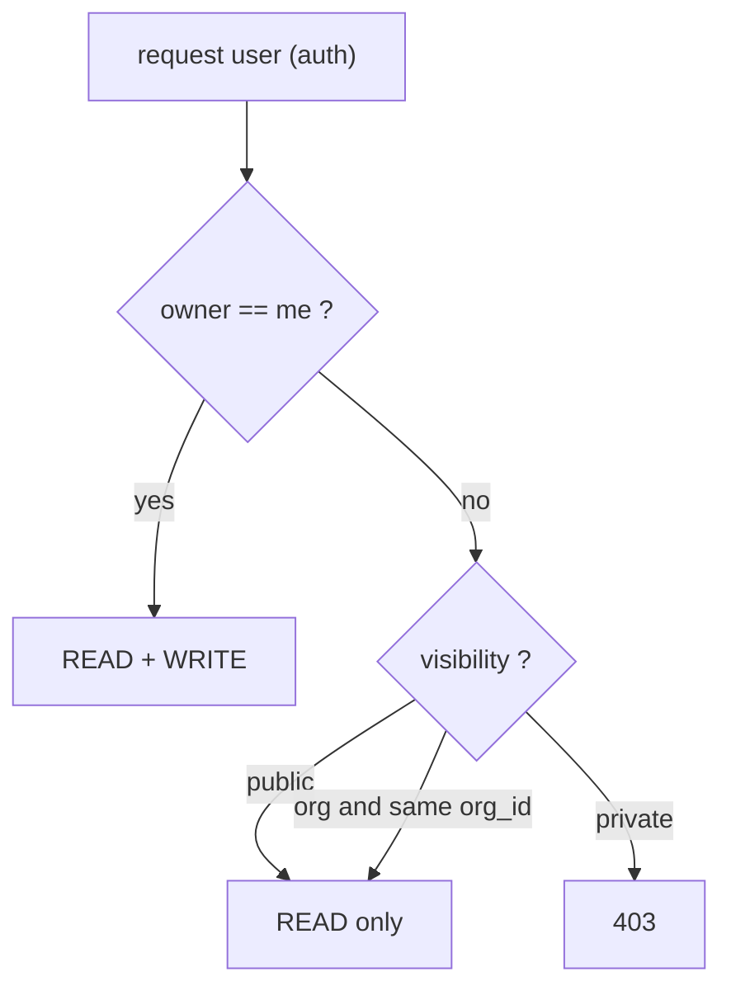
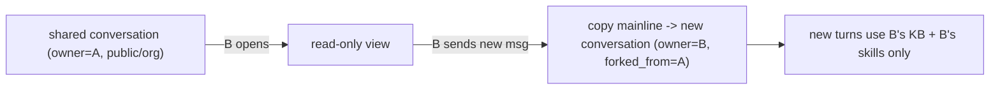
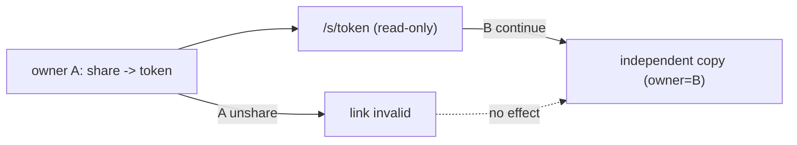

# 引用跳转 + 对象存储 + Logto 三级权限设计

## 现状（已确认）
- Milvus 已存 chunk 级 `content/page_start/section/doc_id/chunk_id/paragraph_index`，`hits` 已带这些字段；前端 [frontend/src/utils/citations.ts](frontend/src/utils/citations.ts) 把行内 `[chunk_id,...]` 转成 `[n](#cite-n)`，[frontend/src/components/SourcesPanel.vue](frontend/src/components/SourcesPanel.vue) 已能在右侧展示 chunk 文本。缺的是"跳转到原始 PDF 对应页"。
- 解析产物（原始 PDF、`knowledge_blocks*.json`、`*_meta.json`）当前只在应用服务器本地磁盘 `uploads/kb_*/<doc>/`，用于 rebuild/re-ingest。
- DB 表与 `owner_id/org_id/visibility` 列已建（[backend/pipeline/db/schema.py](backend/pipeline/db/schema.py)），但路由未落库、未鉴权（M4/M5 未接），`Visibility` 仅 `private|org`，对话仍走内存 `SessionStore`。

---

## 一、引用 → 右侧 tab → PDF 翻页定位
方案：原始 PDF 翻页（pdf.js + `hit.page_start`）。

- 对象存储：新增 [backend/pipeline/clients/object_store.py](backend/pipeline/clients/object_store.py)，用 S3 兼容 SDK（boto3）指向自建 RustFS（env：`OBJECT_STORE_ENDPOINT/ACCESS_KEY/SECRET_KEY/BUCKET`）。
- 入库时（[backend/pipeline/api/routers/ingest.py](backend/pipeline/api/routers/ingest.py) 的 `ingest_upload`）把原始 PDF 上传到对象存储，key 形如 `pdf/<collection>/<doc_id>.pdf`，写入 `documents` 行（含 `pdf_object_key`，需给 `documents` 加该列）。
- 取流：[backend/pipeline/api/routers/files.py](backend/pipeline/api/routers/files.py) 增 `POST /documents/pdf-url`（入参 `doc_id`+`collection`），做读权限校验后返回 RustFS 预签名 URL（短期有效），前端直连对象存储取 PDF。
- 前端：
  - 加依赖 `pdfjs-dist`（或 `vue-pdf-embed`）到 [frontend/package.json](frontend/package.json)。
  - [frontend/src/components/SourcesPanel.vue](frontend/src/components/SourcesPanel.vue) 增第三个 tab「原文」，内嵌 pdf.js，按 `hit.page_start` 跳页；点击角标时（[frontend/src/pages/ChatPage.vue](frontend/src/pages/ChatPage.vue) 的 `onCite`）打开该 tab 并定位到对应文献+页。
  - 可选：若解析产物里有 bbox，传入做页内高亮矩形；无则仅翻页。

---

## 二、解析产物是否需要再存一份
结论：需要，但不是"无意义复制"，按用途保留：
- Milvus 里的 chunk `content` 是**检索 + 片段预览**用，截断（`MAX_LEN_CONTENT`）、chunk 粒度，**不能**替代：原始 PDF（引用查看器必需）、`knowledge_blocks_vec.json`+meta（rebuild/re-ingest 复用向量、不重 embed）。
- 落地：把"原始 PDF + 向量/meta 产物"统一迁到 RustFS（替代/补充本地磁盘），key 规范化按 `<collection>/<doc_id>/`，使多副本后端与重建都可用；本地磁盘仅作可选缓存。
- 不需要再单独建"全文库"：page-jump 直接读 PDF，chunk 预览读 Milvus，全文/版式由 PDF 承载。

---

## 三、Logto 三级权限（private / org / public）+ 继续对话复制语义

### 3.1 模型与读写规则
- `Visibility` 扩为 `private | org | public`（改 [backend/pipeline/db/models.py](backend/pipeline/db/models.py) 与 [frontend/src/api/types.ts](frontend/src/api/types.ts)）。
- 统一鉴权助手 新增 [backend/pipeline/api/authz.py](backend/pipeline/api/authz.py)：
  - 读 `can_read`：`owner==me` ∨ (`visibility==org` ∧ `org_id==my_org`) ∨ `visibility==public`。
  - 写 `can_write`：`owner==me`（org/public 仅 owner 可改可见性，后续可加 org admin）。

### 3.2 落库 + 路由鉴权（接 M4/M5）
- DB 仓储层 新增 [backend/pipeline/db/repo.py](backend/pipeline/db/repo.py)：conversations/messages/kb_collections/documents/user_skills 的 CRUD + 列表过滤（`private(mine) ∪ org ∪ public`）。
- 改造路由按 owner+visibility 过滤/校验：[backend/pipeline/api/routers/collections.py](backend/pipeline/api/routers/collections.py)、[backend/pipeline/api/routers/ingest.py](backend/pipeline/api/routers/ingest.py)、[backend/pipeline/api/routers/skills.py](backend/pipeline/api/routers/skills.py)，并新增 `conversations` 路由 + `visibility` 切换接口。
- 检索范围约束：chat/query（[backend/pipeline/api/routers/chat.py](backend/pipeline/api/routers/chat.py)）必须把检索限定到"当前用户可读的集合集合"，skills 限定到"当前用户可见的 skill"。这是"复制后不继承权限"的技术保证。

### 3.3 继续对话 = 复制为自己的对话
- 读取共享对话（org/public，非本人）：只读展示，历史消息含已生成 answer + `hits` 快照（静态可见）。
- copy-on-continue：当非 owner 在共享对话上发起新消息时，后端把"从根到 active leaf 的主线"复制成一条 `owner==me` 的新对话（记 `forked_from`），随后所有新轮次：
  - 检索只用**我自己可访问的文献库**，
  - 只用**我自己的/我可见的 skills**，
  - 不复制、也不绑定原 owner 的 kb/skill 权限。

---

## 四、前端数据权限适配（分享链接 + 复制到个人）

核心原则：**「访问权限」与「副本」解耦**。分享只授予对**源对象**的只读访问；一旦对方把数据复制到个人名下，副本是独立的 `owner==me` 行，源撤销分享不影响副本。

### 4.1 对话：分享链接 + 撤销 + 复制不受影响
- 分享 token 与 `visibility` 解耦：新增 [backend/pipeline/db/schema.py](backend/pipeline/db/schema.py) 表 `conversation_shares(token PK, conversation_id, owner_id, created_at, revoked_at)`，token 为不透明随机串。
- 后端接口（conversations 路由）：`POST /conversations/share`（创建/返回 token+链接）、`POST /conversations/unshare`（置 `revoked_at`，链接立即失效）、`POST /conversations/shared/get`（凭 token 拉只读对话，校验未撤销）。
- 前端：对话头部增「分享」入口（生成/复制链接、显示分享状态、停止分享）；新增公开只读落地路由（如 `/s/:token`，`meta.public`），无需登录即可只读查看；登录用户点「继续对话」→ 走 §3.3 copy-on-continue 生成独立副本进入自己的对话列表。
- 撤销不影响已复制：副本在 copy 时已落为独立 `conversations` 行（`forked_from` 仅作来源标注，不参与鉴权），故源 `revoked_at` 不影响副本读写。

### 4.2 文献库 / skill：public→org→个人 分组 + 复制到个人
- 列表分组：[frontend/src/pages/LibraryPage.vue](frontend/src/pages/LibraryPage.vue) 与 [frontend/src/pages/SkillsPage.vue](frontend/src/pages/SkillsPage.vue) 依次分区展示 **公开（public） → 组织内（org） → 我的（mine）**；列表数据来自 §3.2 的 `private∪org∪public` 过滤接口，前端按 `visibility/mine` 分组渲染。
- 复制到个人：非本人项显示「复制到个人」按钮，调用后端深拷贝接口：
  - 文献库：新建 `owner==me` 的新集合，复制 Milvus 向量数据 + `documents` 行 + 对象存储产物（PDF/vec/meta），得到完全独立的私有库。
  - skill：复制 skill 文件到我的 `upload_dir/<me>/` + 新建 `user_skills` 行。
- 解耦：复制完成后副本是独立资源；源 owner 改私有/删除/撤销分享都不影响已复制的个人副本。
- 提示：kb 复制涉及 Milvus 数据复制，量大时走异步任务（复用现有 TaskStore 进度回显）。

---

## 风险 / 依赖
- 需确认 Logto access_token 是否带 `organization_id`（[backend/pipeline/auth/logto.py](backend/pipeline/auth/logto.py) 已尝试读取）；org 级共享依赖它，否则 org 维度需退化或走 Logto Management API。
- RustFS 预签名 URL 走 S3 协议；需确认 endpoint/region/path-style 兼容性（boto3 `s3v4` + `addressing_style=path`）。
- M4（对话落库）是 3.3 / 4.1 的前置；当前对话在内存 `SessionStore`，需先迁到 `conversations/messages` 表。
- 文献库「复制到个人」需复制 Milvus 向量数据 + 对象产物，开销较大，须走异步任务，避免阻塞请求。
- 文档同步更新：[ARCHITECTURE.md](ARCHITECTURE.md)（§3.4 可见性加 public、对象存储、引用查看器）、[DEV_PLAN.md](DEV_PLAN.md)。

## 建议落地顺序
权限与落库（M4/M5）是地基，引用查看器相对独立可并行；建议：对象存储客户端 → 引用 PDF 跳转（端到端可见收益）→ DB 仓储+三级权限 → 检索范围约束 → 继续对话复制 → 对话分享链接（撤销/复制不受影响）→ 文献库/skill 分组展示 + 复制到个人。