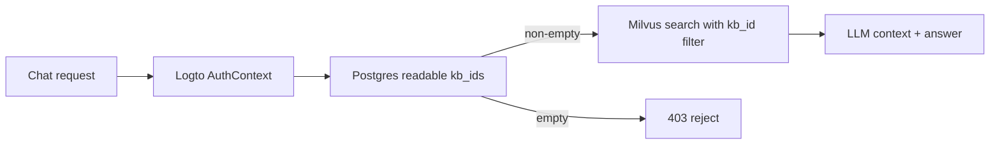

# DP-RAG 架构文档（源真相 · Source of Truth）

> 本文件与 [`DEV_PLAN.md`](./DEV_PLAN.md) 是项目的两份源真相文档。**任何开发首先参考这两份文档**；每一步推进都必须 review 并更新它们。
>
> - 适用版本：sci-loop 多用户重构（Logto 鉴权 + Vue 前端 + Postgres 消息树）
> - 最近更新：2026-06-09

---

## 1. 目标与范围

把原 DP-RAG（单用户、API Key 鉴权、React 前端）改造为**多用户科学知识问答平台**：

- 使用 **Logto** 完成用户登录与鉴权（OIDC + API Resource JWT）。
- **数据按用户隔离**：文献库、对话、skill 默认私有；用户可主动设为「组织内部可读（org）」或「平台公开可读（public）」。
- 前端用 **Vue 3 全量重写**，风格类 Vercel 控制台（轻量、平铺、低视觉噪音）。
- 重新分层：`frontend/`、`backend/`、`deploy/`。
- 预留**多检索源**接口：当前仅文献库 RAG，后续接入企业内部材料数据库（Postgres / SQL）。
- 自动化 CI：push 自动构建并推送前/后端镜像；前端变更自动部署到 GitHub Pages。

---

## 2. 仓库结构

```text
DP_RAG/
├── ARCHITECTURE.md          # 本文件（源真相）
├── DEV_PLAN.md              # 开发计划与排期（源真相）
├── README.md
├── backend/                 # Python 后端（FastAPI + RAG pipeline）
│   ├── pipeline/            # RAG 流水线 + API (api/、clients/、flows/、retrieval/ …)
│   │   ├── api/             # FastAPI: app、routers、deps、sessions、tasks
│   │   ├── auth/            # [新] Logto JWT 校验、用户/组织上下文
│   │   ├── db/              # [新] psycopg 3 连接池 + pydantic 模型 + 幂等 DDL（无 ORM/迁移）
│   │   └── retrieval_sources/ # [新] 多检索源抽象（literature / sql …）
│   ├── ragas_eval/          # 评测工具
│   ├── synthetic_qa_gen/    # 合成问答数据生成
│   ├── pyproject.toml       # 依赖（uv 管理）+ ruff 配置；uv.lock 锁定版本
│   ├── local_api_config.yaml
│   ├── run_api.py / run_api.sh
│   └── Dockerfile
├── frontend/                # Vue 3 前端（Vite + pnpm + UnoCSS …）
│   ├── src/
│   │   ├── api/             # API 客户端、SSE、类型
│   │   ├── auth/            # @logto/vue 配置与 guard
│   │   ├── components/      # 复用组件
│   │   ├── composables/     # useChat、useTheme、useStream …
│   │   ├── i18n/            # vue-i18n（zh-CN / en）
│   │   ├── pages/           # 路由页面：chat / library / skills / settings
│   │   ├── stores/          # 轻量状态（pinia 可选，先用 composable）
│   │   └── utils/           # citations、latex 等纯函数
│   ├── uno.config.ts / vite.config.ts / package.json
│   └── Dockerfile
└── deploy/
    ├── docker-compose.yaml  # backend + postgres + RustFS + (milvus 外部)
    └── .env.example
```

---

## 3. 鉴权与多用户

### 3.1 Logto 配置

| 项 | 值 |
|----|----|
| 应用 ID | `skjc9b4p12ykvz40vshjc`（SPA） |
| 认证端点（endpoint） | `https://auth.dplink.cc/` |
| Issuer | `https://auth.dplink.cc/oidc` |
| JWKS URI | `https://auth.dplink.cc/oidc/jwks` |
| API Resource（audience） | `https://funmg.dp.tech/sci-loop-api` |
| Scope | API scope: `all:data`；用户信息 scope: `email profile` |
| Redirect URIs | `https://rag.hal9k.one/callback`、`http://localhost:9527/callback` |
| Post-logout URIs | `https://rag.hal9k.one`、`https://localhost:9527` |

### 3.2 前端鉴权流程（@logto/vue）

1. `@logto/vue` 插件配置 `endpoint`、`appId`、`resources: ['https://funmg.dp.tech/sci-loop-api']`、`scopes: ['all:data', 'email', 'profile']`。
2. 路由守卫：未认证 → `signIn(redirectUri=/callback)`；`/callback` 页处理 `handleSignInCallback`。
3. 调用后端前用 `getAccessToken('https://funmg.dp.tech/sci-loop-api')` 取 **JWT access_token**，放入 `Authorization: Bearer <jwt>`。
4. SSE 同样走带 token 的 `fetch + ReadableStream`（不用 EventSource，因 EventSource 不支持自定义头）。

### 3.3 后端鉴权流程（JWT 本地校验）

`backend/pipeline/auth/`：

1. 启动时缓存 JWKS（`https://auth.dplink.cc/oidc/jwks`，带 TTL + 401 失效刷新）。
2. 每请求校验 Bearer JWT：
   - 签名（ES384，依 JWKS `kid`）
   - `iss == https://auth.dplink.cc/oidc`
   - `aud` 含 `https://funmg.dp.tech/sci-loop-api`
   - `exp` / `nbf`
   - `scope` 含 `all:data`
3. 提取用户上下文 `AuthContext`：`user_id = sub`、`org_id`、`organizations`、`organization_roles`、`role=user|admin|root`、`scopes`。Logto 组织角色 claim 形如 `<org_id>:sci-loop-admin`，后端按 `root > admin > user` 取最高角色；角色模板名可由 `LOGTO_ROLE_USER/ADMIN/ROOT` 覆盖。
4. 注入到依赖：`current_user = Depends(require_auth)`。
5. 兼容开发：`AUTH_DISABLED=1` 时跳过校验，使用固定 `dev` 用户（仅本地）。

> 组织变更语义：Logto 是身份与当前组织成员关系的权威源；Postgres 是业务资源归属的权威源。Logto 后台修改用户组织/角色后，只影响刷新 token 后的新请求与新建资源，不自动迁移历史资源的 `owner_id/org_id/visibility`。

> 过渡：旧 `API_KEYS` 鉴权移除；`/health` 可作为探针，`/stats` 与日志查看需 admin/root。

### 3.4 可见性模型

每个可拥有的资源（文献库 collection、对话 conversation、skill）带：

- `owner_id`（Logto `sub`）
- `org_id`（可空）
- `visibility`：`private`（默认，仅 owner）/ `org`（组织内部可读）/ `public`（平台所有用户可读）

普通访问规则：

- **读**：`owner_id == me` 或（`visibility == org` 且 `org_id == my_org`）或 `visibility == public`。
- **写**：默认仅 `owner_id == me`。
- **设置 `org` 可见**：无组织普通用户禁止；root 可管理已有组织资源。
- 列表接口返回 `private(mine) ∪ org(my_org) ∪ public`，并标注 `mine: bool` 与 `visibility`。
- 对话分享链接与 `visibility` 解耦：`conversation_shares` 记录不透明 token；撤销后 token 失效。其他用户通过分享继续对话时，后端复制当前主线为自己的私有对话（`forked_from` 仅审计），后续新轮次只使用新 owner 可读的文献库与 skill。

管理访问规则：

- `sci-loop-admin`：通过 `/admin/resources/*` 管理同 `org_id` 用户的 KB、文献、对话、skill、generation runs、ingest tasks，包括 private 数据；普通列表不混入这些私有数据。
- `sci-loop-root`：通过 admin API 管理全平台资源，包括无组织用户资源。
- owner、admin、root 的敏感管理动作写入 `audit_logs`；admin/root 查看他人 private 数据也写审计。

### 3.5 RAG 检索权限链路

Milvus 不保存用户权限，也不做 `owner/org/public` 判断。权限判断统一在 Postgres/repo 层完成，检索链路必须满足：

1. 前端默认不要求用户选择知识库；不传筛选条件时语义为 `all_accessible`。
2. 后端在 `/chat/append` 与 `/query` 中根据 `AuthContext` 从 Postgres 计算当前用户可读 `kb_ids = private(mine) ∪ org(my_org) ∪ public`。
3. 如果前端传入高级筛选 `kb_ids` / 单个 `collection`，后端取 `requested ∩ readable`；交集为空则拒绝。
4. 后端把最终 `kb_ids` 下推给 Milvus filter：`kb_id in [...]`。Milvus 只在统一物理 collection 的授权 KB 范围内召回 chunk。
5. professional mode 的自定义 skill 也先从 `user_skills` 计算当前用户可读 `allowed_ids`，注入 `professional.skills.allowed_ids`，避免共享/复制对话继续使用原 owner 私有 skill。
6. copy-on-continue 后新对话 owner 变为当前用户，后续新轮次重新按当前用户 `AuthContext` 计算 KB/skill 可见范围，不继承源对话 owner 的资源权限。



---

## 4. 存储边界总览

| 存储 | 权威职责 | 保存内容 | 不保存/不负责 |
|------|----------|----------|---------------|
| Postgres | 业务权威状态、权限、任务状态、事件回放索引 | 用户/组织归属、visibility、conversations/messages、generation_runs/message_events、kb_collections/documents、ingest_tasks/items/events、user_skills、conversation_shares | 向量索引、大体积 PDF/解析产物、低延迟临时 fanout |
| Milvus | 文献 chunk 向量与检索索引 | 单物理 `literature_chunks` collection 内的 chunk rows：`kb_id`、dense/sparse 向量、content、context、doc_id/doc_name、chunk_id、type、section、page_start、paragraph_index、publication_year、bbox/related_assets 等 | 用户权限、conversation、task 状态、PDF 原文、完整解析产物 |
| Redis | 运行时队列与低延迟事件分发 | generation run queue、generation run stream、ingest task queue、ingest task stream，短 TTL 事件副本 | 权威任务状态、长期消息内容、权限判断 |
| RustFS/S3 | 大文件与可重建 artifacts | 原始 PDF、解析 JSON、向量/meta sidecar、run artifacts（如专家模式完整大上下文） | 权限判断、向量搜索、任务状态 |

---

## 5. 数据模型（Postgres）

**不使用 ORM / 迁移框架**：直接用 **psycopg 3**（连接池 + `dict_row`）以灵活使用 Postgres 高级查询；用 **pydantic** 定义数据结构（`pipeline/db/models.py`），取回的 dict 行 `model_validate` 即可。表结构（`pipeline/db/schema.py` 的幂等 DDL）在 **FastAPI lifespan 启动时自动检查/初始化**。备份与迁移走 **shell 全量备份**（`deploy/backup.sh` / `restore.sh`，`pg_dump | gzip`）。核心表：

### 5.1 conversations / messages（消息树）

对话以**消息树**记录多轮：每条 message 记录其 `parent_id`（上一轮）。修改历史对话重新生成时，从被改消息处**分叉**出新分支。`conversations.active_leaf_message_id` 指向当前主线叶子；**加载主线**：从 active leaf 沿 `parent_id` 递归到根，再反转。

```text
conversations
  id              uuid pk
  owner_id        text            -- Logto sub
  org_id          text null
  visibility      text            -- private | org | public
  title           text
  active_leaf_message_id uuid null
  forked_from     text null       -- copy-on-continue 来源，仅审计
  created_at / updated_at timestamptz

messages
  id              uuid pk
  conversation_id uuid fk -> conversations.id
  parent_id       uuid null fk -> messages.id   -- 消息树父指针；分叉点有多个子
  role            text            -- user | assistant
  content         text            -- user 文本 / assistant 最终回答
  -- assistant 元数据（检索结果与执行信号）
  hits            jsonb null
  context         text null
  research        jsonb null
  usage           jsonb null
  latency_s       float null
  -- 生成参数快照（便于"基于此分支重生成"）
  params          jsonb null      -- {mode, top_k, professional, use_agentic, sources, kb_ids, doc_ids}
  status          text            -- pending | streaming | done | failed | stopped
  error           text null
  created_at      timestamptz
```

主线推导（伪代码）：

```python
def mainline(conv):
    chain = []
    mid = conv.active_leaf_message_id
    while mid:
        m = messages[mid]; chain.append(m); mid = m.parent_id
    return list(reversed(chain))
```

分叉：编辑某条 user 消息 → 以其 `parent_id` 为父新建 user 消息（兄弟分支）→ 生成 assistant 子消息 → 更新 `active_leaf_message_id` 指向新 assistant。旧分支保留，可切换。

### 5.2 generation_runs / message_events（生产级生成运行）

FastAPI Web 不直接执行模型生成；Web 创建 run 并入 Redis 队列，独立 `backend-worker` 消费 run。Postgres 保存 run 状态与可回放事件，Redis Streams 只负责低延迟 fanout。

```text
generation_runs
  id                   text pk       -- run_<hex>
  conversation_id      text fk -> conversations.id
  user_message_id      text fk -> messages.id
  assistant_message_id text fk -> messages.id
  owner_id / org_id
  status               text          -- queued | running | done | failed | stopped
  params               jsonb         -- 生成参数快照
  error                text null
  cancel_requested     boolean
  redis_stream         text
  artifact_prefix      text          -- runs/<owner>/<run_id>/...
  created_at / updated_at / started_at / finished_at

message_events
  id                   bigserial pk
  run_id               text fk -> generation_runs.id
  seq                  bigint        -- run 内递增序号
  type                 text          -- status | thinking | text | done | error
  payload              jsonb
  created_at           timestamptz
  unique(run_id, seq)
```

### 5.3 kb_collections（文献库归属）

业务知识库只存在于 Postgres；`name` 是业务 `kb_id/slug`，不再代表 Milvus 物理 collection 名。所有 KB 的 chunk 统一写入 `MILVUS_COLLECTION` 指定的物理 collection。

```text
kb_collections
  name            text pk         -- 业务 kb_id/slug
  display_name    text
  owner_id        text
  org_id          text null
  visibility      text            -- private | org | public
  created_at / updated_at
```

> Milvus 物理隔离不再使用多个 collection；权限隔离由 Postgres `kb_collections` 计算 readable `kb_id`，检索时通过 Milvus `kb_id in [...]` filter 实现。

### 5.4 documents（文献条目，文献管理页）

```text
documents
  id              uuid pk
  collection_name text fk -> kb_collections.name  -- 业务 kb_id
  owner_id        text
  doc_id          text            -- pipeline doc_id（原文件名 stem）
  title           text
  filename        text
  year            int null
  pdf_object_key  text null       -- RustFS/S3 原始 PDF
  artifact_prefix text null       -- RustFS/S3 解析产物前缀 <kb_id>/<doc_id>/
  source_document_id text null    -- copy-to-mine 来源
  status          text            -- parsing | ready | failed
  task_id         text null       -- 关联异步灌入任务
  chunk_count     int
  created_at / updated_at
```

### 5.5 ingest_tasks / ingest_task_items / ingest_task_events（解析入库任务）

解析/入库与对话生成一样采用 Web/Worker 分离：FastAPI Web 只保存上传文件、写 task/items、入 Redis 队列；独立 `ingest-worker` 慢慢执行 parse → chunk → embed → Milvus store，并把进度事件写入 Postgres + Redis Stream。

```text
ingest_tasks
  id              text pk
  owner_id / org_id
  collection_name text fk -> kb_collections.name  -- 业务 kb_id
  kind            text            -- upload / rebuild / parse / load_vec
  status          text            -- queued | running | done | failed | cancelled
  progress        float
  total_items / completed_items / failed_items / skipped_items int
  cancel_requested boolean
  result / params jsonb
  error           text null
  redis_stream    text
  created_at / updated_at / started_at / finished_at

ingest_task_items
  id              text pk
  task_id         text fk -> ingest_tasks.id
  collection_name / owner_id / doc_id             -- collection_name 为业务 kb_id
  filename        text
  pdf_path / doc_dir text       -- worker 当前任务使用的本地缓存路径
  pdf_object_key / artifact_prefix text
  status          text          -- pending | running | ready | failed | cancelled | skipped
  error           text null
  chunk_count     int

ingest_task_events
  id              bigserial pk
  task_id         text fk -> ingest_tasks.id
  seq             bigint
  type            text          -- status | progress | item | done | failed | cancelled | error
  payload         jsonb
  unique(task_id, seq)
```

### 5.6 user_skills（自定义 skill 归属）

skill 物理文件仍存 `upload_dir/<owner_id>/`；本表记录归属与可见性，列表合并：内置（只读）∪ 我的 ∪ org-public。

```text
user_skills
  id              text            -- skill id
  owner_id        text
  org_id          text null
  visibility      text
  name / description
  source_owner_id / source_skill_id text null -- copy-to-mine 来源
  created_at / updated_at
  (pk = owner_id + id)
```

### 5.7 conversation_shares（分享链接）

```text
conversation_shares
  token           text pk         -- 不透明随机串
  conversation_id text fk -> conversations.id
  owner_id        text
  created_at      timestamptz
  revoked_at      timestamptz null
```

分享链接只授予源对话的只读访问；撤销只让 token 失效，不影响已 copy-to-mine 的独立副本。

### 5.8 audit_logs（管理审计）

```text
audit_logs
  id              bigserial pk
  actor_id        text            -- 执行动作的 Logto sub
  actor_role      text            -- user | admin | root
  actor_org_id    text null
  target_owner_id text null
  resource_type   text            -- kb_collection | document | conversation | skill | generation_run | ingest_task
  resource_id     text
  action          text            -- admin_list | admin_read | set_visibility | delete | cancel | stop | stream
  metadata        jsonb
  created_at      timestamptz
```

admin/root 查看他人 private 数据、修改可见性、删除资源、取消任务、停止 run 都应写入审计日志。

### 5.9 对象存储（RustFS / S3 compatible）

新增 `backend/pipeline/clients/object_store.py`，通过 `boto3` 连接自建 RustFS（S3 path-style + v4 签名）。用途：

- 保存原始 PDF：`<kb_id>/<doc_id>/source.pdf`，供引用原文 tab 预签名访问。
- 保存解析/向量/meta 产物：`<kb_id>/<doc_id>/...`，用于 rebuild / re-ingest，替代单机本地磁盘作为长期事实来源。
- 前端不经后端转发大文件；后端 `POST /documents/pdf-url` 读权限校验后返回短期预签名 URL。

---

## 6. Milvus 数据模型

Milvus 只存“可检索的文献 chunk 数据”，不存用户权限、不存对话、不存任务状态。权限由 Postgres 的 `kb_collections/documents` 控制；后端先计算可读 `kb_ids`，再在统一物理 collection 中用 `kb_id in [...]` filter 检索。

全平台默认使用一个物理 collection（默认 `literature_chunks`）。chunk row 主要字段：

```text
pk                 varchar       -- Milvus 主键，{kb_id}::{doc_id}::{chunk_id}
kb_id              varchar       -- 业务知识库 id/slug，来自 Postgres kb_collections.name
doc_id             varchar       -- 文献内部 id，通常是 PDF 文件名 stem
doc_name           varchar       -- 文献标题/显示名
chunk_id           varchar       -- chunk id
type               varchar       -- title | summary | text | table | image | equation | references
section            varchar       -- 章节/小节名
content            varchar       -- 检索命中的正文/表格/图注/公式文本，截断上限见 MAX_LEN_CONTENT
context            varchar       -- 额外上下文，截断上限见 MAX_LEN_CONTEXT
embedding_text     varchar       -- 向量化文本
dense_embedding    float_vector  -- dense embedding
sparse_embedding   sparse_vector -- BM25 Function 生成的 sparse 向量
page_start         int
paragraph_index    int
publication_year   int
related_assets     json/string   -- 图表/公式/正文互相关联信息
bbox               json          -- 当前 chunk 的主定位框 {page,x0,y0,x1,y1}
bboxes             json          -- 跨 block/chunk 的多个定位框
page_width         int           -- bbox 坐标所属页面宽度（有则用于前端缩放）
page_height        int           -- bbox 坐标所属页面高度（有则用于前端缩放）
```

使用方式：

- 入库：`knowledge_blocks_vec.json` + 业务 `kb_id` → `MilvusIngester.ingest_file(kb_id=...)` → upsert rows 到统一物理 collection。
- 检索：`QueryFlow` 使用后端计算出的可读 `kb_ids` 构造 Milvus filter：`kb_id in [...]`。
- 展示引用：前端拿 `hits` 中的 `kb_id/doc_id/page_start/chunk_id/content/bbox` 渲染引用与来源；PDF 原文不来自 Milvus，而来自 RustFS 预签名 URL。

---

## 7. Redis 数据模型

Redis 是运行时协调层，不是权威数据源。Redis 重启后，最终对话消息、任务状态、事件回放仍以 Postgres 为准。

当前 key/stream 约定：

```text
REDIS_RUN_QUEUE
  default: dprag:generation:runs
  type: list
  value: run_id
  purpose: generation worker 通过 BLPOP 消费对话生成任务

REDIS_RUN_STREAM_PREFIX:<run_id>
  default prefix: dprag:generation:stream
  type: stream
  event field: JSON string
  purpose: 对话生成 status/thinking/text/done/error 的低延迟 fanout

REDIS_INGEST_QUEUE
  default: dprag:ingest:tasks
  type: list
  value: task_id
  purpose: ingest-worker 通过 BLPOP 消费解析入库任务

REDIS_INGEST_STREAM_PREFIX:<task_id>
  default prefix: dprag:ingest:stream
  type: stream
  event field: JSON string
  purpose: 解析入库 status/progress/item/done/failed/cancelled 的低延迟 fanout
```

Redis Stream 只保留短期窗口（`REDIS_*_STREAM_MAXLEN` + `REDIS_*_STREAM_TTL`）。SSE 端点必须先从 Postgres 事件表按 `seq` 回放，再 tail Redis Stream。

---

## 8. RustFS / S3 对象布局

RustFS 存大文件与可重建 artifacts，不做权限判断。所有读取都必须先走后端权限校验，再返回短期预签名 URL。

当前 key 规范：

```text
<kb_id>/<doc_id>/source.pdf
  原始 PDF，引用原文 tab 使用

<kb_id>/<doc_id>/knowledge_blocks.json
<kb_id>/<doc_id>/knowledge_blocks_vec.json
<kb_id>/<doc_id>/knowledge_blocks_meta.json
<kb_id>/<doc_id>/uniparser_result.json
<kb_id>/<doc_id>/uniparser_meta.json
...
  解析、分块、向量、meta 产物，用于 rebuild/re-ingest

runs/<owner_id>/<run_id>/...
  高级专家模式大体积 run artifacts 预留，如完整 synthesis context、每轮检索结果等
```

对象存储 key 会在 Postgres 中以 `documents.pdf_object_key`、`documents.artifact_prefix`、`ingest_task_items.pdf_object_key`、`ingest_task_items.artifact_prefix` 等字段建立索引关系。

> Milvus schema 增加了 `kb_id/bbox/bboxes/page_width/page_height`，不保留旧 schema 兼容。部署该版本后需要 drop/recreate `MILVUS_COLLECTION`（默认 `literature_chunks`）并重新入库。

---

## 9. 多检索源抽象（预留 SQL 接入）

`backend/pipeline/retrieval_sources/`：

```python
class RetrievalSource(Protocol):
    key: str                 # "literature" | "enterprise_sql" | ...
    def retrieve(self, query, *, ctx: AuthContext, params) -> list[Hit]: ...
    def health(self) -> str: ...
```

- 现有：`LiteratureSource`（封装现 pipeline Milvus 检索）。
- 预留：`EnterpriseSqlSource`（接收自然语言 → text2sql → Postgres 查询 → 结构化 Hit），实现接口即可挂载。
- 请求体新增 `sources: string[]`（默认 `["literature"]`）。前端「设置」可勾选启用的检索源；后端按 ctx 鉴权后并行检索、融合。
- 当前阶段仅实现 `literature`，`enterprise_sql` 留接口与开关（前端灰显/Beta）。

---

## 10. API 概览（/api/v1，统一 JWT 鉴权）

### 10.0 API 约定（强制）

- **业务接口统一用 `POST`**，参数走 JSON body（或 multipart 上传）；路径不再用 path-param 的 REST 风格，改为动词式路径（如 `/collections/list`、`/collections/delete`），body 携带 `name`/`id` 等。
- **非 SSE 接口统一封装** `APIResponse`（`pipeline/api/models.py`）：

  ```python
  class APIResponse(BaseModel, Generic[T]):
      code: int = 0          # 0 成功；非 0 业务/系统错误
      data: T | None = None
      msg: str = ""
  ```

- **SSE 流式接口**（`/chat/stream`、`/messages/stream`、日志流）不走该封装，仍是 `text/event-stream`。
- **例外**：运维探针 `GET /health`、`GET /stats` 保持 `GET`（供容器 HEALTHCHECK / 监控），不算业务接口。

> 落地策略：新增/重做的多用户端点（M4/M5）一律按本约定（POST + APIResponse）实现；现有继承端点的统一迁移见 DEV_PLAN「API 约定迁移」任务（需同步更新前端 client 与 `docs/后端协议文档.md`）。

### 10.1 端点（POST + APIResponse，除标注外）

| 分组 | 端点 | 说明 | 变化 |
|------|------|------|------|
| 对话 | `POST /chat/append` | 创建 user/assistant 占位消息 + `generation_runs`，入 Redis 队列并返回 `run_id` | 新增：生产级入口 |
| 对话 | `GET /runs/{run_id}/stream`（SSE） | 先回放 Postgres `message_events`，再 tail Redis Stream 实时输出 | 新增：可重连/可回放 |
| 对话 | `GET /runs/{run_id}/status` `POST /runs/{run_id}/stop` | 查询/停止 generation run | 新增 |
| 对话 | `POST /chat` `POST /chat/stream` | 旧请求内生成入口 | 已禁用（410），统一走 run-based 架构 |
| 对话 | `GET /conversations` `GET /conversations/{id}` `PATCH /conversations/{id}/visibility` | 会话列表/读取/可见性（过渡期兼容旧 REST；M9.6 统一 POST） | 新增 |
| 对话 | `POST /conversations/append`（分叉重生成：`parent_message_id` / 编辑 user 文本） | 追加/分叉 | 新增 |
| 对话 | `POST /conversations/share` `/conversations/unshare` `/conversations/shared/get` `/conversations/copy-to-mine` | 分享链接、撤销、公开只读读取、复制为个人副本 | 新增 |
| 对话 | `POST /messages/stop`（body `message_id`） | 停止后台生成（不依赖前端连接） | 新增 |
| 对话 | `GET /messages/{id}/stream`（SSE） | 重连续读正在生成消息的增量 | 新增 |
| 文献 | `GET /collections` `POST /collections` `DELETE /collections/{name}` `POST /collections/{name}/rebuild` `PATCH /collections/{name}/visibility` | 文献库 CRUD + 归属/可见性（M9.6 统一 POST） | 改造 |
| 文献 | `POST /ingest/upload`（multipart） | submit-only：保存 PDF/对象存储、创建 `ingest_tasks/items`、入 Redis 队列，立即返回 `task_id` | 改造 |
| 文献 | `GET /ingest/tasks/{task_id}` `GET /ingest/tasks/{task_id}/stream` `POST /ingest/tasks/{task_id}/cancel` | 解析入库任务状态、事件流回放/实时输出、取消 | 新增 |
| 文献 | `GET /collections/{name}/documents` `DELETE /collections/{name}/documents/{doc_id}` `POST /documents/pdf-url` `POST /collections/copy-to-mine` | 文献增删查、PDF 预签名、复制到个人 | 改造/新增 |
| 技能 | `GET /skills` `POST /skills` `DELETE /skills/{id}` `PATCH /skills/{id}/visibility` `POST /skills/copy-to-mine` `/skills/template` | skill CRUD + 可见性 + 复制到个人（M9.6 统一 POST） | 改造 |
| 管理 | `GET /admin/me` `/admin/resources/*` `/admin/audit-logs` | org admin/root 查看管理范围内资源与审计日志；普通资源列表不混入管理视图 | 新增 |
| 运维 | `GET /health` `GET /stats` `GET /logs/sessions*`；`GET /doc_summary` | health 可作探针；stats/logs 需 admin/root；doc_summary 需文献读权限 | 保留/改造 |

### 10.2 SSE 事件协议（保持兼容并扩展）

事件 `type`：`status` | `thinking` | `text` | `done` | `error`。run-based SSE 事件带 `run_id` 与递增 `seq`；前端断线后可带最后 `seq` 重连，服务端先从 `message_events` 回放，再 tail Redis Stream。

### 10.3 「前端断连后台不停止」与「正在生成不可发起新对话」

- 对话生成在独立 `backend-worker` 服务中执行，Web 进程只负责入队与 SSE fanout。Worker 将增量写入 `message_events` 并发布到 Redis Stream，同时更新 `messages.content/status`。
- 文献解析/入库在独立 `ingest-worker` 服务中执行，Web 进程只保存上传文件并创建任务；worker 逐文件处理并写入 `ingest_task_events`。
- 前端「停止」调用 `POST /runs/{run_id}/stop` 置位取消标志，worker 在下一个事件边界协作式结束并落库 `status=stopped`。
- 前端在任一消息 `streaming` 期间禁用发送新消息（按钮置灰，复用现有 busy 逻辑），但允许「停止」。

---

## 11. 前端架构

### 11.1 技术栈

Vue 3 · `<script setup>` · TypeScript · Vite 8 · pnpm · UnoCSS（含 presetIcons，icon-in-css）· Vitest · Oxlint · VueUse · vue-i18n · `@logto/vue` · markstream-vue。

### 11.2 UI 风格

完整规范见根目录 **[`UI_STYLE.md`](./UI_STYLE.md)**（源真相）。要点：类 Vercel 控制台、低噪音平铺；**按钮无 border/无 shadow**（主功能纯色主题色填充 `btn-primary`，次要用主题色透明填充 `btn-secondary`）；**优先分割线**而非卡片套卡片；圆角 6–8px；主标题深色 `text-base`、次要描述 `text-muted`；light/dark/system + 自定义主题色（CSS 变量 token，`--accent-soft` 随主题色派生）；滚动条细、`scrollbar-gutter: stable` 不抖动；布局用 flex/grid + 局部 overflow。图标用 presetIcons；不明显的 icon/button 提供 title/tooltip。

### 11.3 路由与页面

- `/` → 重定向到 `/chat`
- `/chat`（含历史对话侧栏、消息树主线、分叉切换）
- `/library`（文献管理：库与文献的增删改查、上传解析、可见性）
- `/skills`（skill 管理：增删改查、可见性、模版）
- `/settings`（主题、语言、检索源开关、默认检索参数、账号/登出）
- `/callback`（Logto 回调）

### 11.4 关键 composables

- `useAuthFetch`：注入 access_token 的 fetch。
- `useChatStream`：fetch + ReadableStream 解析 SSE；支持 abort（仅断前端连接）、reconnect（重连续读）。
- `useTheme`：light/dark/system + 主题色 token。
- `useRetrievalSources`：检索源开关与能力探测。

### 11.5 问答页交互要点

- 选择文献库中的单篇文献（`doc_ids`）或整库；支持上传文献（上传后自动进入文献库管理）。
- 开关：是否启用文献库检索、专家模式、Agentic、流式、检索源。
- 停止生成、修改历史输入重生成（分叉）、正在生成时禁发新对话、前端断连后台继续。
- 引用查看：有效引用文献角标可点击，打开右侧「原文」tab；前端用 EmbedPDF 读取 `POST /documents/pdf-url` 返回的预签名 PDF URL，并按 `hit.page_start` 跳页。摘要与命中片段 tab 保留。
- 数据权限 UX：Library/Skills 页按 public → org → mine 分组；非本人资源只读并提供「复制到我的」，副本是独立 private 资源，源 owner 撤销共享不影响副本。Chat 页可生成/撤销分享链接，`/s/:token` 公开只读展示，登录用户可继续对话并复制到个人。

---

## 12. 部署拓扑

```text
浏览器 ──HTTPS──> rag.hal9k.one (GitHub Pages, 前端静态)
   │ access_token (Logto JWT, audience=sci-loop-api)
   └──HTTPS──> funmg.dp.tech/sci-loop-api (反代) ──> backend FastAPI :8080
                                                       ├── Postgres (conversations/messages/归属/分享)
                                                       ├── Redis (run queue + stream fanout)
                                                       ├── RustFS/S3 (PDF 原文 + 解析产物)
                                                       ├── Milvus (向量库)
                                                       └── LLM/Embedding/Reranker (内网)
backend-worker (独立服务进程) ──Redis run queue──> generation run ──写 Postgres/Redis Stream
ingest-worker  (独立服务进程) ──Redis ingest queue──> parse/embed/store ──写 Postgres/Redis Stream
Logto: auth.dplink.cc (OIDC + JWKS)
```

- 前端构建为静态站点，`base` 与路由需适配自定义域（`rag.hal9k.one`，SPA history 模式 + 404 fallback）。
- 后端 CORS 允许 `https://rag.hal9k.one` 与本地 `http://localhost:9527`。
- `VITE_API_BASE` 默认 `https://funmg.dp.tech/sci-loop-api`，本地用 Vite proxy。
- FastAPI Web、generation worker、ingest worker 使用同一后端镜像但独立服务进程：Web 不执行模型生成或解析入库长任务，worker 不暴露公网 HTTP。

---

## 13. CI/CD

GitHub Actions：

1. **变更检测**：`backend/**` 变化构建后端镜像；`frontend/**` 变化构建前端镜像并部署 Pages。
2. **镜像命名**：`dp-harbor-registry.cn-zhangjiakou.cr.aliyuncs.com/dplc/qsar:sci-loop_{backend|frontend}_{yymmdd}_{commit_sha:0:4}`。
3. **私有仓库登录**：读取仓库 secrets `DP_USERNAME` / `DP_PASSWORD`。
4. **前端部署**：`frontend/**` 变化时 build → 部署到 GitHub Pages（域名 `rag.hal9k.one` 已配置 CNAME）。

---

## 14. 配置与环境变量

见 [`deploy/.env.example`](./deploy/.env.example)。要点：

- **后端服务/鉴权/存储**：`DATABASE_URL`、`LOGTO_ISSUER`、`LOGTO_JWKS_URI`、`LOGTO_AUDIENCE`、`LOGTO_REQUIRED_SCOPE`、`AUTH_DISABLED`、`CORS_ORIGINS`、`API_ROOT_PATH`、`UPLOAD_DIR`、`SESSION_DIR`、`FRONTEND_BASE_URL`。
- **对象存储（RustFS/S3）**：`OBJECT_STORE_ENDPOINT`、`OBJECT_STORE_PUBLIC_ENDPOINT`、`OBJECT_STORE_ACCESS_KEY`、`OBJECT_STORE_SECRET_KEY`、`OBJECT_STORE_BUCKET`、`OBJECT_STORE_REGION`。
- **Redis（生产级对话/入库运行）**：`REDIS_URL`、`REDIS_RUN_QUEUE`、`REDIS_RUN_STREAM_PREFIX`、`REDIS_RUN_STREAM_MAXLEN`、`REDIS_RUN_STREAM_TTL`、`REDIS_INGEST_QUEUE`、`REDIS_INGEST_STREAM_PREFIX`、`REDIS_INGEST_STREAM_MAXLEN`、`REDIS_INGEST_STREAM_TTL`。
- **基建连接（pipeline，容器化的主要配置方式）**：通过环境变量覆盖 pipeline 配置，**镜像无需挂载 YAML**。加载优先级：`default_config.yaml < CONFIG_PATH 文件 < 环境变量 < 运行时`。映射表见 `backend/pipeline/config.py` 的 `_ENV_OVERRIDES`：
  - Embedding：`EMBEDDING_API_BASE` / `EMBEDDING_API_KEY` / `EMBEDDING_MODEL`
  - Milvus：`MILVUS_BACKEND` / `MILVUS_URI` / `MILVUS_TOKEN` / `MILVUS_DB_NAME` / `MILVUS_COLLECTION` / `MILVUS_DIM`
  - 生成 LLM：`LLM_API_BASE` / `LLM_API_KEY` / `LLM_MODEL`
  - Reranker：`RERANKER_API_BASE` / `RERANKER_API_KEY` / `RERANKER_MODEL`
  - Reflection：`REFLECTION_API_BASE` / `REFLECTION_API_KEY` / `REFLECTION_MODEL`
  - 解析：`PARSER_BACKEND` / `MINERU_AUTHORIZATION` / `UNIPARSER_API_KEY`
  - 规则：变量未设置或为空串时跳过（不覆盖默认）；`MILVUS_DIM` 等数值会做类型转换。
  - `CONFIG_PATH` 仅用于额外/算法参数的 YAML（可选）；镜像默认空，`local_api_config.yaml` 仅本机联调用。
- **前端（构建期 `VITE_`）**：`VITE_API_BASE`、`VITE_LOGTO_ENDPOINT`、`VITE_LOGTO_APP_ID`、`VITE_LOGTO_RESOURCE`、`VITE_LOGTO_SCOPES`。

---

## 15. 关键决策记录（ADR 摘要）

| # | 决策 | 理由 |
|---|------|------|
| 1 | 数据按用户隔离 + org-public 共享 | 用户明确要求；用 owner_id + visibility 实现 |
| 2 | 后端本地校验 Logto JWT（非 introspection） | 性能；API Resource 已配置，audience=sci-loop-api |
| 3 | 对话用 Postgres 消息树 | 用户明确要求；支持编辑历史分叉与多分支 |
| 4 | 生成与 SSE 解耦（后台任务 + 缓冲） | 满足「前端断连后台不停止」与重连续读 |
| 5 | 多检索源抽象 | 预留企业 SQL 接入，最小化未来改动 |
| 6 | 前端 GitHub Pages，后端独立域 | 用户已配置 rag.hal9k.one；JWT 跨域 + CORS |
| 7 | 后端用 uv + ruff（弃 pip/requirements） | 统一依赖/虚拟环境与 lint/format；`pyproject.toml` + `uv.lock` |
| 8 | DB 用 psycopg 3 + pydantic（弃 SQLAlchemy/Alembic） | 灵活使用 Postgres 高级查询；lifespan 自动建表；shell 全量备份 |
| 9 | 业务接口统一 POST + `APIResponse{code,data,msg}` 封装 | 协议一致；SSE 与运维探针为例外 |
| 10 | PDF 原文与解析产物进入 RustFS/S3 | 多副本后端可重建；前端引用原文用预签名 URL，避免后端转发大文件 |
| 11 | 分享授权与副本解耦 | 撤销分享只影响源链接；copy-to-mine 后副本独立，后续问答使用新 owner 权限 |
| 12 | 对话生成采用 run-based Web/Worker 分离 | Web 只入队和 SSE fanout；worker 执行长任务；Postgres 权威存储，Redis 负责队列与实时事件 |
| 13 | 解析入库采用 ingest task Web/Worker 分离 | 上传接口只提交任务；ingest-worker 逐文件处理；Postgres 回放进度，Redis 负责实时事件 |
