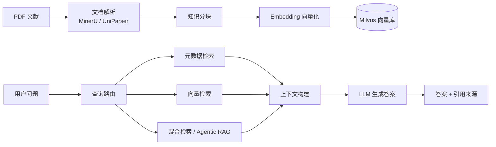
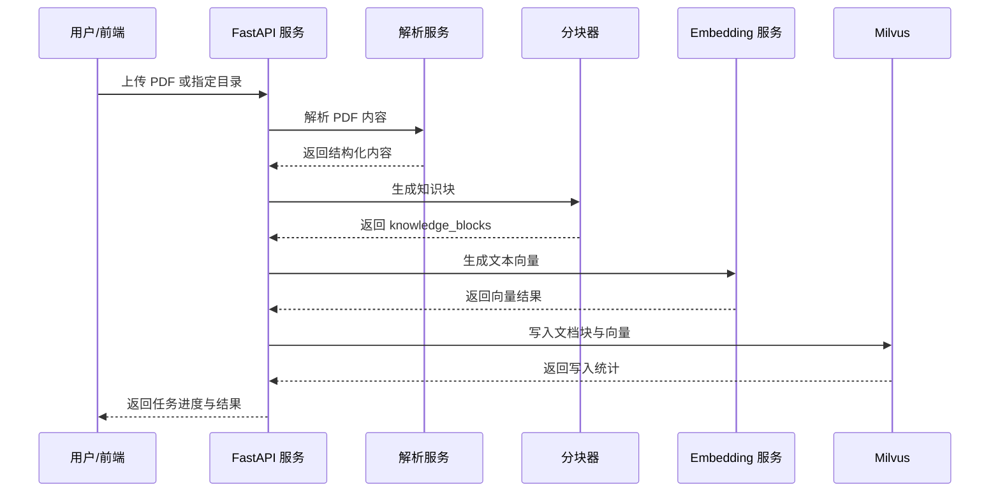
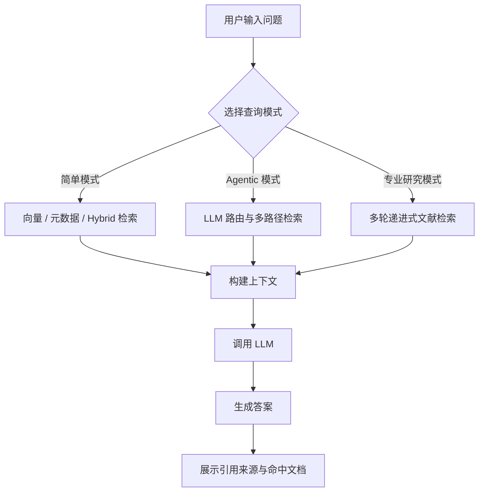
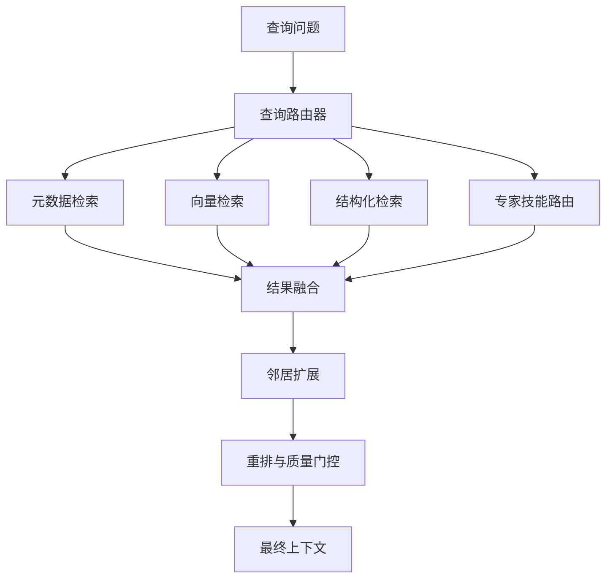
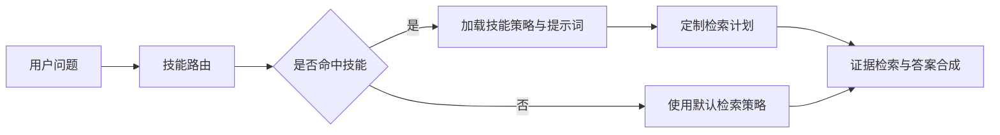

# DP-RAG 功能描述文档

## 1. 项目概述

DP-RAG 是一个面向科研文献的端到端 RAG（Retrieval-Augmented Generation，检索增强生成）系统。项目支持从 PDF 文献解析、知识分块、向量化入库，到用户提问、混合检索、智能体式检索和答案生成的完整流程。

系统主要由后端 RAG 流水线、FastAPI 服务、React 前端界面、评测与数据生成工具几部分组成，适合用于科研论文问答、文献证据检索、专业主题综述和知识库管理。

## 2. 总体架构



## 3. 核心功能

### 3.1 文献解析与知识灌入

系统支持将 PDF 文献导入知识库，并自动完成解析、分块、向量化和存储。

主要能力：

- 支持单篇 PDF 和目录批量灌入。
- 支持 MinerU / UniParser 等解析后端。
- 自动生成文档中间产物，如解析结果、知识块、向量化结果。
- 支持重建知识库、追加导入、跳过已存在文档。
- 支持直接加载已有向量 JSON 文件到 Milvus。

灌入流程如下：



### 3.2 智能问答

用户可以基于已入库的科研文献进行自然语言提问，系统检索相关证据并生成回答。

主要能力：

- 支持普通问答和流式输出。
- 支持按指定 Milvus collection 查询。
- 支持简单检索模式和 Agentic RAG 模式。
- 返回答案、命中文献片段、上下文、耗时、调用统计等信息。
- 前端保留历史对话，方便继续查看和复用。

问答流程如下：



### 3.3 检索增强与专业研究模式

项目不只提供基础向量检索，也包含多种检索增强策略，用于提升科研场景下的召回质量和答案可信度。

主要能力：

- Metadata Retriever：基于文档元数据、标题、年份、实体等字段检索。
- Vector Retriever：基于 Embedding 相似度进行语义检索。
- Hybrid Retriever：结合多路检索结果并进行排序融合。
- Neighbor Expansion：对命中片段进行上下文邻居扩展。
- Reranker：对候选结果进行重排和质量诊断。
- Research Agent：支持多轮检索、证据补充、gap 分析和综述式回答。

检索策略关系如下：



### 3.4 知识库管理

系统提供知识库 collection 管理能力，便于维护多个文献库。

主要能力：

- 查看当前 Milvus collections。
- 删除指定 collection。
- 查看文档统计信息和集合统计。
- 查询单篇文档摘要信息。
- 在前端进行知识库导入、管理和状态查看。

### 3.5 专家技能管理

项目支持配置“专家技能”，用于让不同领域或任务采用不同的检索策略、提示词和合成规则。

主要能力：

- 查看已启用的技能列表。
- 新建或编辑技能配置。
- 设置触发条件、优先路径、充分性标准、调优参数和保护规则。
- 配置 synthesis system / thinking / user 等提示词模板。
- 删除自定义技能。

专家技能执行关系如下：



### 3.6 前端界面

前端基于 React + Vite 实现，提供完整的可视化操作界面。

主要页面：

- 智能问答：输入问题、查看答案、引用来源、思考过程和历史对话。
- 知识库：上传或导入文献，管理知识库任务和 collection。
- 专家技能：查看、新建、编辑和删除检索技能。
- 系统状态：查看 Milvus、LLM、Embedding、Reranker 等依赖状态和集合统计。
- 检索日志：查看会话级检索日志，便于排查检索链路。
- 设置弹窗：配置 API 地址、鉴权信息等前端连接参数。

前端交互结构如下：

```mermaid
flowchart TD
    UI[DP-RAG 前端] --> Chat[智能问答]
    UI --> KB[知识库管理]
    UI --> Skills[专家技能]
    UI --> Status[系统状态]
    UI --> Logs[检索日志]
    UI --> Settings[系统设置]

    Chat --> API1[/chat, /chat/stream]
    KB --> API2[/ingest, /collections, /tasks]
    Skills --> API3[/skills]
    Status --> API4[/health, /stats]
    Logs --> API5[/logs/sessions]
```

## 4. 后端 API 功能

后端使用 FastAPI 提供服务接口，主要接口类别包括：

| 类别 | 主要接口 | 功能说明 |
| --- | --- | --- |
| 问答 | `/chat`, `/chat/stream` | 普通问答、流式问答、专业研究模式 |
| 会话 | `/sessions` | 创建和删除对话会话 |
| 灌入 | `/ingest/rebuild`, `/ingest/append`, `/ingest/parse`, `/ingest/load-vec`, `/ingest/upload` | 文档解析、知识库重建、追加导入、上传灌入 |
| 任务 | `/tasks/{task_id}` | 查询异步任务进度和结果 |
| 知识库 | `/collections` | 查看和删除 Milvus collection |
| 技能 | `/skills`, `/skills/template` | 管理专家技能配置 |
| 状态 | `/health`, `/stats`, `/doc_summary` | 健康检查、统计、文档摘要 |
| 日志 | `/logs/sessions` | 查看和订阅检索日志 |

## 5. 辅助模块

### 5.1 RAGAS 评测

`ragas_eval` 模块用于生成或执行检索与回答质量评测，辅助分析系统在不同文献和问题集上的效果。

### 5.2 合成问答数据生成

`synthetic_qa_gen` 模块用于基于语料构建索引、回填数据、生成问答数据集，可用于评测集构建和检索效果验证。

### 5.3 路由与研究智能体

`pipeline/routing` 和 `pipeline/retrieval` 中包含查询路由、Function Calling 解析、专业研究检索、技能选择、上下文构建等逻辑，是系统智能检索能力的核心。

## 6. 典型使用场景

- 科研论文问答：上传论文后直接询问实验结论、参数、方法和对比结果。
- 文献综述辅助：使用专业研究模式对某一主题进行多轮检索和证据汇总。
- 多知识库管理：为不同课题建立独立 collection，按需查询和维护。
- 检索质量调试：通过命中片段、来源面板和检索日志分析回答依据。
- 专家策略定制：针对特定领域配置技能、提示词和检索优先级。

## 7. 项目结构摘要

```text
DP_rag_skill/
├── pipeline/              # 后端 RAG 流水线与 FastAPI 服务
│   ├── api/               # API 路由、会话、任务、日志
│   ├── clients/           # LLM、Embedding、Milvus、解析服务客户端
│   ├── flows/             # 灌入流程和查询流程
│   ├── processors/        # 分块、语义切分、向量化等处理器
│   ├── retrieval/         # 检索器、智能体、上下文构建、重排
│   ├── routing/           # 查询路由、技能路由和函数调用解析
│   └── steps/             # parse / chunk / embed / store / retrieve / generate 单步任务
├── frontend/              # React + Vite 前端界面
├── ragas_eval/            # RAG 评测相关脚本
├── synthetic_qa_gen/      # 合成问答数据生成工具
├── uploads/skills/        # 用户上传或自定义的专家技能
└── run_api.py             # API 服务启动入口
```

## 8. 简要总结

DP-RAG 的核心价值是把科研 PDF 转换为可检索、可引用、可追踪的知识库，并通过多策略检索和 LLM 生成能力，为用户提供带证据来源的科研文献问答体验。项目同时具备知识库管理、专家技能配置、系统状态监控、检索日志和评测工具，适合进一步扩展为专业科研知识助手。
